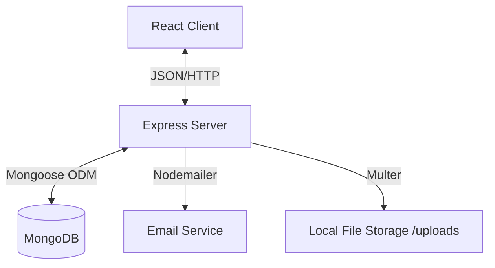
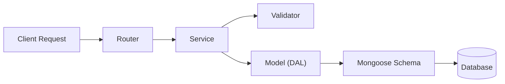
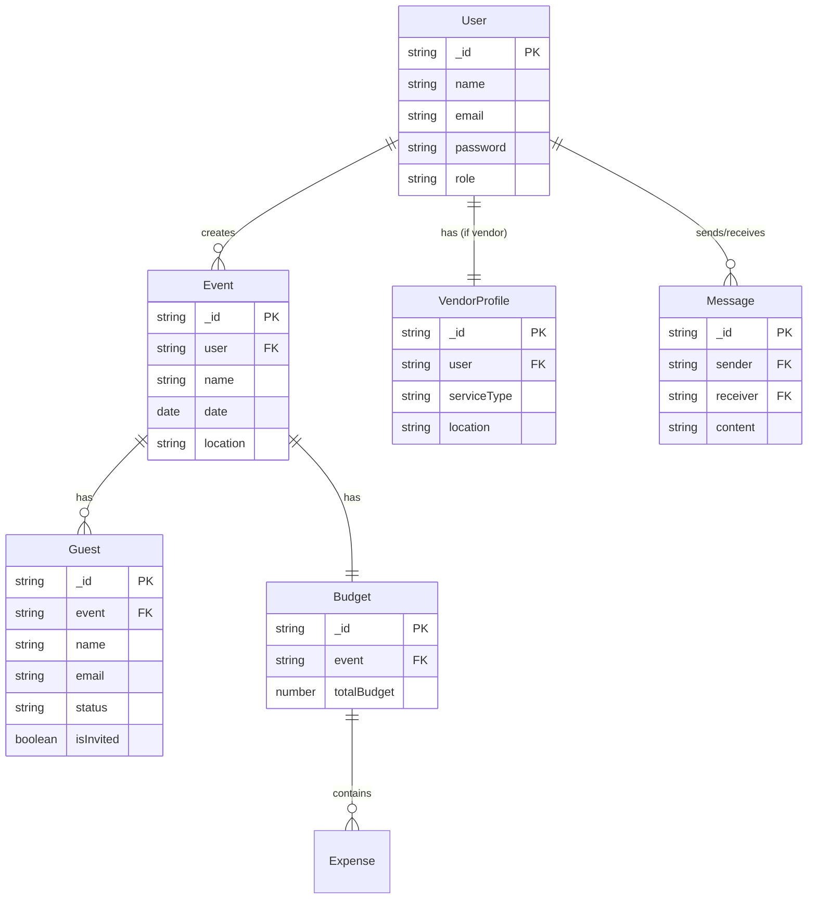
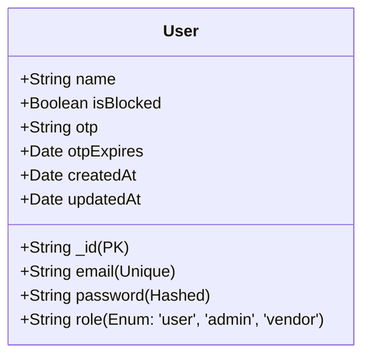
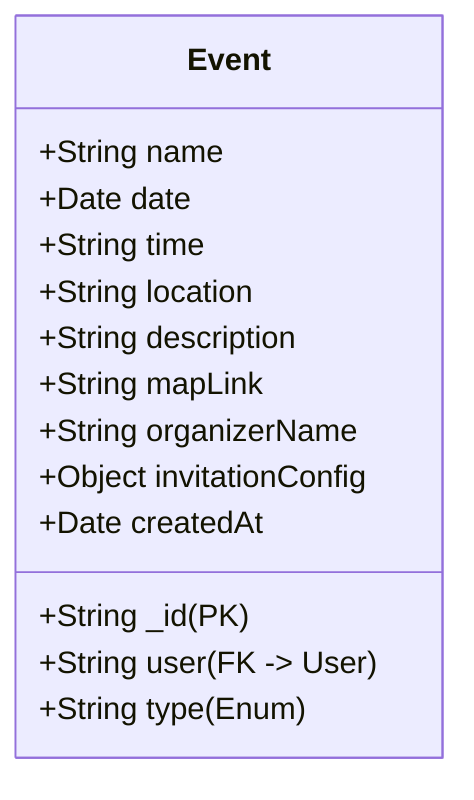
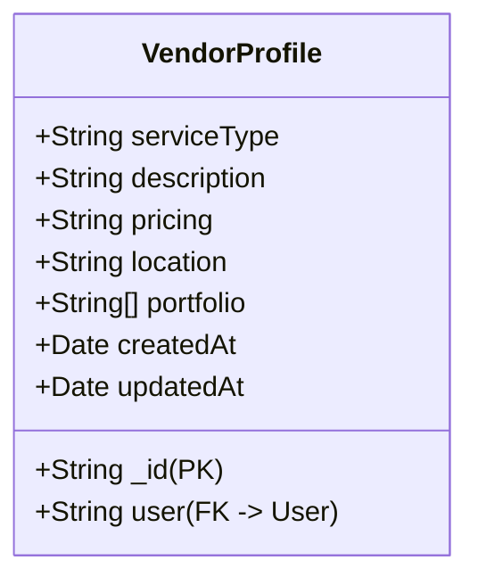
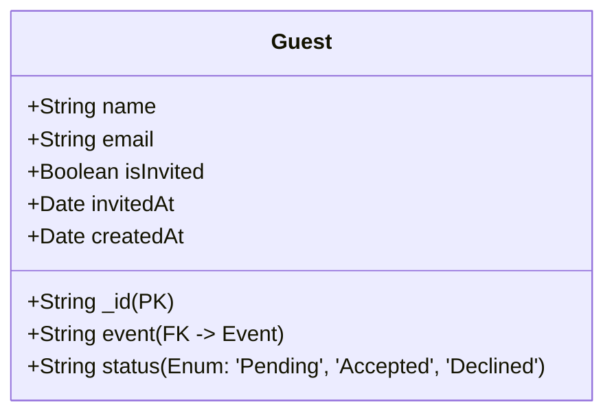
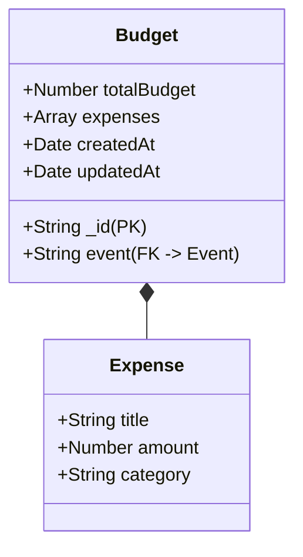
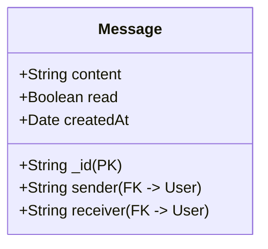

# EventEmpire Project Documentation

## 1. System Architecture

EventEmpire follows a **Layered MERN Stack Architecture**. This ensures separation of concerns, scalability, and maintainability.

### 1.1 High-Level Architecture

### 1.2 Backend Layered Design
The backend is structured into distinct layers:
1.  **Routes**: Entry points that handle HTTP requests and responses.
2.  **Services**: Business logic layer (validation, calculations, flow control).
3.  **Data Access Layer (DAL)**: Wrappers around Mongoose models to abstract DB operations.
4.  **Database**: MongoDB storage.

---

## 2. Project Structure & File Guide

### 2.1 Backend Structure (`/server`)
*   **`server.js`**: Main entry point. Configures Express, Middleware (CORS, Helmet), Database connection, and Routes.
*   **`config/`**: Configuration files.
    *   `db.js`: Connects to MongoDB using Mongoose.
*   **`middleware/`**: Custom middleware functions.
    *   `authMiddleware.js`: Verifies JWT tokens (`protect`) and checks roles (`admin`, `vendor`).
    *   `roleMiddleware.js`: Granular role-based access control.
    *   `uploadMiddleware.js`: Configures Multer for image uploads.
*   **`models/`**: Data Access Layer (DAL). These files export functions to interact with the DB, *not* just the schemas.
    *   `User.js`, `Event.js`, `VendorProfile.js`, etc.: contain `createOne`, `find`, `findById` wrappers.
*   **`routes/`**: API Route definitions.
    *   `authRoutes.js`: Login, Register, OTP.
    *   `eventRoutes.js`: CRUD for Events.
    *   `vendorRoutes.js`: Vendor search, profile, portfolio.
    *   `adminRoutes.js`: User management.
*   **`services/`**: Business Logic.
    *   `authService.js`: Registration logic, password hashing, token generation.
    *   `eventService.js`: Event creation rules, budget initialization.
*   **`utils/`**: Helper functions.
    *   `schemas/`: Actual Mongoose Schemas (`UserSchema.js`, etc.).
    *   `sendEmail.js`: Nodemailer configuration.
    *   `requestLogger.js`, `errorLogger.js`: Logging utilities.

### 2.2 Frontend Structure (`/client`)
*   **`src/App.js`**: Main component, defines Routes and Navigation.
*   **`src/context/`**: Global State Management.
    *   `AuthContext.js`: Manages user login state, token storage, and logout.
*   **`src/components/`**: Reusable UI components.
    *   `Navbar.js`: Responsive navigation bar with role-based links.
    *   `PrivateRoute.js`: HOC to protect routes based on login status and roles.
*   **`src/pages/`**: Main Application Pages.
    *   `Home.js`: Landing page with statistics.
    *   `Login.js` / `Register.js`: Auth pages.
    *   `UserDashboard.js`: User's main hub (Create Event, View Events).
    *   `VendorDashboard.js`: Vendor's hub (Profile, Portfolio, Inquiries).
    *   `AdminDashboard.js`: Admin hub (Manage Users/Vendors).
    *   `EventPage.js`: Detailed event view (Budget, Guests, Tasks).
    *   `FindVendors.js`: Search interface for users.
    *   `Messages.js`: Chat interface.

---

## 3. Detailed Workflows

### 3.1 User Registration & Login
1.  **User** submits Registration Form.
2.  **Frontend** sends `POST /api/auth/register`.
3.  **Backend** (`authService`):
    *   Checks if email exists.
    *   Hashes password.
    *   Creates User document.
    *   Generates JWT Token.
4.  **Frontend** receives Token, saves to `localStorage`, and updates `AuthContext`.

### 3.2 Event Creation (with Validation)
1.  **User** clicks "Create Event" on Dashboard.
2.  **Frontend** validates Date/Time (must be future).
3.  **Frontend** sends `POST /api/events`.
4.  **Backend** (`eventService`):
    *   Validates data again.
    *   Creates Event document.
    *   Creates an empty Budget document linked to the Event.
5.  **Backend** returns the new Event.

### 3.3 Vendor Image Upload
1.  **Vendor** selects file in `VendorDashboard`.
2.  **Frontend** sends `POST /api/vendors/upload` (Multipart/Form-Data).
3.  **Backend** (`uploadMiddleware`):
    *   Saves file to `server/uploads/`.
    *   Generates unique filename.
4.  **Backend** returns file URL (e.g., `http://localhost:5000/uploads/image-123.jpg`).
5.  **Frontend** sends `POST /api/vendors/portfolio` with the URL.
6.  **Backend** updates `VendorProfile` adding the URL to the portfolio array.

### 3.4 RSVP Flow
1.  **Host** sends invitation from `EventPage`.
2.  **Backend** generates a unique link (`/rsvp/:guestId`) and emails it to the guest.
3.  **Guest** clicks the link and lands on the public `RSVPPage`.
4.  **Guest** clicks "Accept" or "Decline".
5.  **Frontend** sends `POST /api/guests/rsvp/:guestId`.
6.  **Backend** updates the guest's status in the database.
7.  **Host** sees the updated status (Accepted/Declined) on their dashboard.

---

## 4. API Reference

### Auth (`/api/auth`)
| Method | Endpoint | Description | Why/Reason | Input | Output |
| :--- | :--- | :--- | :--- | :--- | :--- |
| POST | `/register` | Register new user | Creates a new account in the system. Hashes password for security. | `{name, email, password, role}` | `{token, user}` |
| POST | `/login` | Login user | Authenticates credentials and issues a JWT token for session management. | `{email, password}` | `{token, user}` |
| POST | `/verify-otp` | Verify 2FA OTP | Adds an extra layer of security (2FA) to confirm user identity. | `{userId, otp}` | `{token, user}` |
| POST | `/forgot-password` | Request reset link | Allows users to recover their account if they forget their password. | `{email}` | `{message}` |

### Events (`/api/events`)
| Method | Endpoint | Description | Why/Reason | Input | Output |
| :--- | :--- | :--- | :--- | :--- | :--- |
| POST | `/` | Create Event | Core feature. Allows users to start planning a new event. | `{name, date, location...}` | `{event}` |
| GET | `/` | Get User's Events | Displays the list of events on the dashboard so the user can manage them. | - | `[{event}, ...]` |
| GET | `/:id` | Get Event Details | Fetches full details (guests, budget) when a user clicks on a specific event. | - | `{event}` |
| PUT | `/:id` | Update Event | Allows users to change details like date or location if plans change. | `{name, date...}` | `{event}` |
| DELETE | `/:id` | Delete Event | Removes an event if it is cancelled or no longer needed. | - | `{message}` |

### Vendors (`/api/vendors`)
| Method | Endpoint | Description | Why/Reason | Input | Output |
| :--- | :--- | :--- | :--- | :--- | :--- |
| GET | `/search` | Search Vendors | Allows users to find vendors (caterers, etc.) based on type or location. | `?query=...` | `[{vendor}, ...]` |
| GET | `/profile` | Get My Profile | Loads the vendor's own profile data for editing in the dashboard. | - | `{profile}` |
| POST | `/profile` | Update Profile | Allows vendors to update their services, pricing, and description. | `{serviceType, location...}` | `{profile}` |
| POST | `/upload` | Upload Image | Handles the physical file upload to the server's storage. | `File (image)` | `{imageUrl}` |
| POST | `/portfolio` | Add to Portfolio | Links the uploaded image URL to the vendor's profile in the database. | `{imageUrl}` | `{profile}` |

### Admin (`/api/admin`)
| Method | Endpoint | Description | Why/Reason | Input | Output |
| :--- | :--- | :--- | :--- | :--- | :--- |
| GET | `/users` | Get All Users | Gives admins an overview of all registered users and vendors. | - | `[{user}, ...]` |
| PUT | `/users/:id` | Block/Unblock | Allows admins to ban abusive users or restore access. | `{isBlocked: boolean}` | `{user}` |
| DELETE | `/users/:id` | Delete User | Allows admins to permanently remove a user and their data. | - | `{message}` |

### Budget (`/api/budget`)
| Method | Endpoint | Description | Why/Reason | Input | Output |
| :--- | :--- | :--- | :--- | :--- | :--- |
| GET | `/:eventId` | Get Budget | Fetches the financial details for a specific event. | - | `{budget}` |
| POST | `/:eventId/expenses` | Add Expense | Tracks spending (e.g., "Catering: $500") to help users stay on budget. | `{title, amount, category}` | `{budget}` |

---

## 5. Security Features
*   **JWT Authentication**: Stateless, secure token-based auth.
*   **Password Hashing**: Bcrypt used for storing passwords.
*   **Role-Based Access Control (RBAC)**: Middleware ensures Users cannot access Admin routes.
*   **Helmet**: Sets secure HTTP headers (configured to allow Cross-Origin images).
*   **Input Validation**: Validators check all incoming data before processing.
---

## 6. Schema Architecture

This section provides a detailed breakdown of the database schema, including relationships, field definitions, and data types.

### 6.1 Entity Relationship Diagram (ERD)

The following diagram illustrates the high-level relationships between the core entities in the EventEmpire database.

---

### 6.2 Schema Details

#### 6.2.1 User Schema
The `User` entity represents all registered users, including regular users, vendors, and administrators.

| Field | Type | Description |
| :--- | :--- | :--- |
| `_id` | String | Custom unique identifier (e.g., `U001`). Primary Key. |
| `name` | String | Full name of the user. |
| `email` | String | Email address. Must be unique across the system. |
| `password` | String | Bcrypt-hashed password for security. |
| `role` | String | Defines user permissions. Default is 'user'. |
| `isBlocked` | Boolean | Admin control flag to disable access. |
| `otp` | String | One-Time Password for 2FA or password reset. |

#### 6.2.2 Event Schema
The `Event` entity stores details about an event created by a user.

| Field | Type | Description |
| :--- | :--- | :--- |
| `_id` | String | Custom unique identifier (e.g., `E001`). Primary Key. |
| `user` | String | Reference to the `User` who created the event. |
| `name` | String | Title of the event. |
| `type` | String | Category (Wedding, Birthday, Corporate, etc.). |
| `invitationConfig` | Object | Settings for the custom invitation (theme, message). |

#### 6.2.3 Vendor Profile Schema
The `VendorProfile` entity extends the `User` entity for users with the 'vendor' role, storing business-specific details.

| Field | Type | Description |
| :--- | :--- | :--- |
| `_id` | String | Custom unique identifier (e.g., `V001`). Primary Key. |
| `user` | String | Reference to the `User` document. |
| `serviceType` | String | The category of service provided (e.g., Photography). |
| `portfolio` | Array[String] | List of URLs to images uploaded by the vendor. |

#### 6.2.4 Guest Schema
The `Guest` entity represents an individual invited to a specific event.

| Field | Type | Description |
| :--- | :--- | :--- |
| `_id` | String | Custom unique identifier (e.g., `G001`). Primary Key. |
| `event` | String | Reference to the `Event` the guest is invited to. |
| `status` | String | RSVP status ('Pending', 'Accepted', 'Declined'). |
| `isInvited` | Boolean | Tracks if the invitation email has been sent. |

#### 6.2.5 Budget Schema
The `Budget` entity tracks financial planning for an event.

| Field | Type | Description |
| :--- | :--- | :--- |
| `_id` | String | Custom unique identifier (e.g., `B001`). Primary Key. |
| `event` | String | Reference to the `Event`. |
| `totalBudget` | Number | The spending limit set by the user. |
| `expenses` | Array[Object] | List of individual expense items. |

#### 6.2.6 Message Schema
The `Message` entity stores communication between users (typically a User and a Vendor).

| Field | Type | Description |
| :--- | :--- | :--- |
| `_id` | String | Custom unique identifier (e.g., `M001`). Primary Key. |
| `sender` | String | Reference to the `User` sending the message. |
| `receiver` | String | Reference to the `User` receiving the message. |
| `read` | Boolean | Status indicating if the message has been viewed. |
