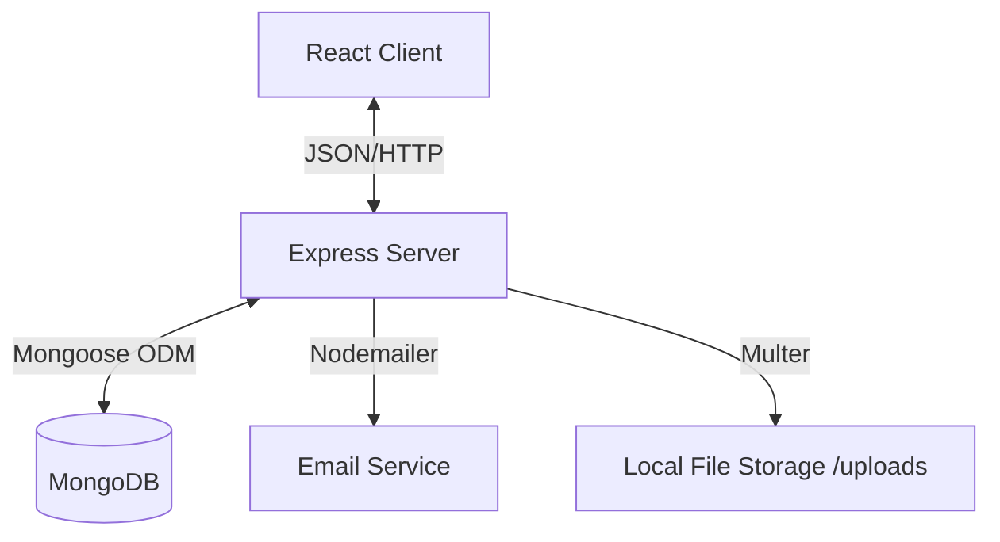
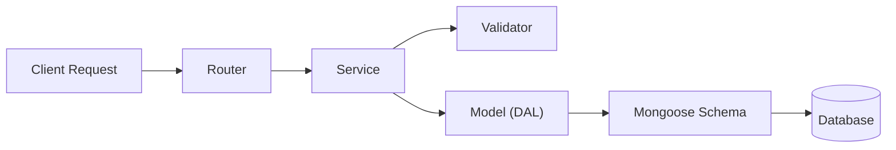
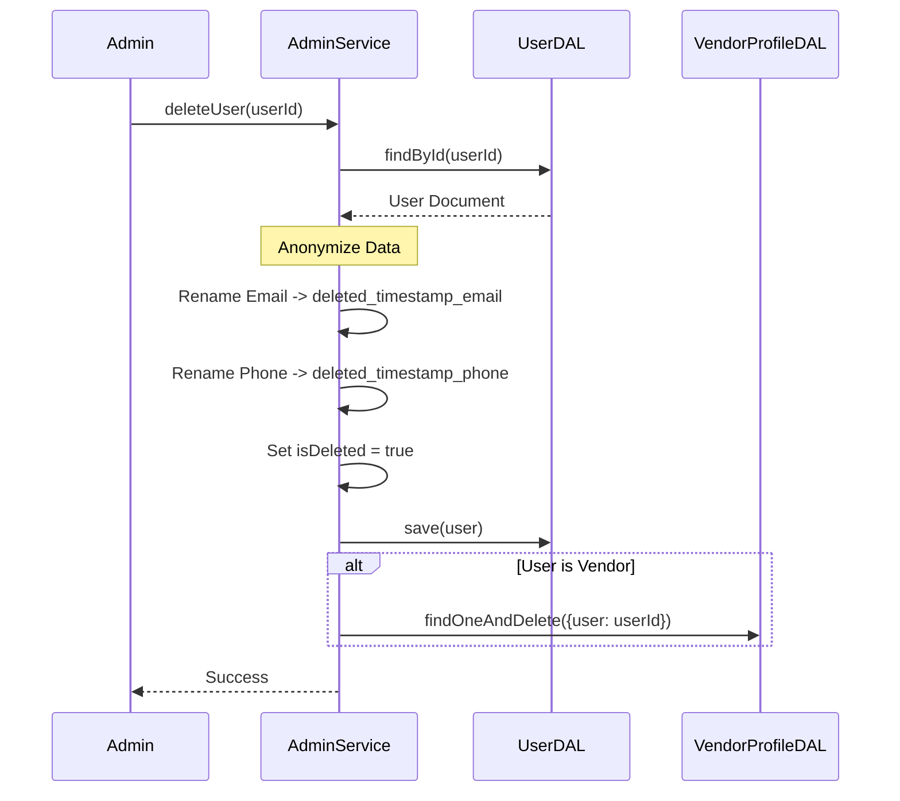
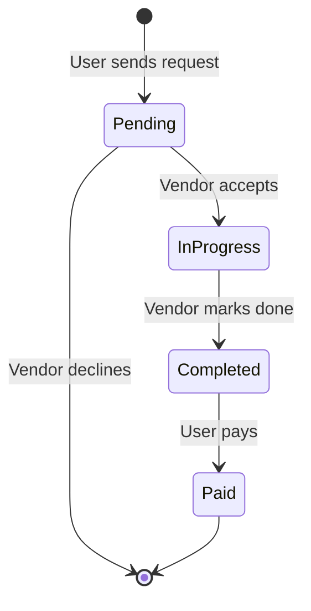
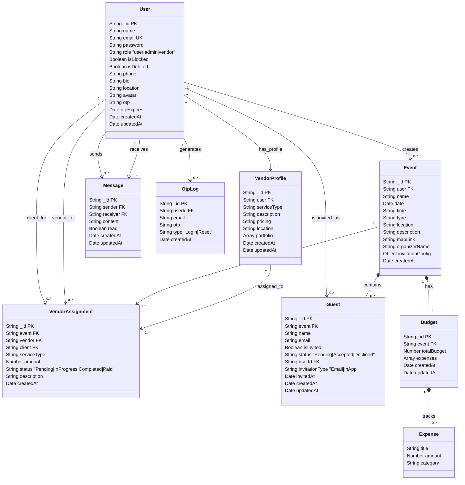

# EventEmpire Project Documentation

## 1. System Architecture

EventEmpire follows a **Layered MERN Stack Architecture**. This ensures separation of concerns, scalability, and maintainability.

### 1.1 High-Level Architecture

### 1.2 Backend Layered Design
The backend is structured into distinct layers:
1.  **Routes**: Entry points that handle HTTP requests and responses.
2.  **Services**: Business logic layer (validation, calculations, flow control).
3.  **Data Access Layer (DAL)**: Wrappers around Mongoose models to abstract DB operations.
4.  **Database**: MongoDB storage.

### 1.3 Key Workflows

#### 1.3.1 Soft Delete & Anonymization Flow
Preserves data integrity while respecting user privacy.

#### 1.3.2 Vendor Assignment Flow
Manages the lifecycle of a vendor job.

---

## 2. File Operations Guide (Deep Dive)

### 2.1 Backend Services (`/server/services`)
Contains the core business logic.

*   **`adminService.js`**
    *   `getAllUsers()`: Fetches users/vendors excluding `isDeleted: true`.
    *   `deleteUser(id)`: Performs **Soft Delete**. Renames email/phone to free them up, sets `isDeleted=true`, and hard-deletes associated `VendorProfile`.
    *   `blockUser(id)`: Toggles `isBlocked` status.
*   **`authService.js`**
    *   `registerUser()`: Hashes password, creates User, generates JWT.
    *   `loginUser()`: Verifies credentials. **Checks `isDeleted`** to deny access.
    *   `verifyLoginOtp()`: Second step of 2FA.
*   **`eventService.js`**
    *   `createEvent()`: Validates date, creates Event, and initializes an empty Budget.
    *   `getEventById()`: Fetches event with populated Guest and Budget data.
*   **`guestService.js`**
    *   `addGuest()`: Adds a guest. If `invitationType` is 'Email', sends invite immediately.
    *   `resendInvitation()`: **Resets status to 'Pending'** and resends email.
    *   `getMyInvitations()`: Fetches invitations for a logged-in user (EventEmpire User).
*   **`vendorService.js`**
    *   `createOrUpdateProfile()`: Upserts vendor profile.
    *   `searchVendors()`: Filters by query, location, service type. Uses `findWithPopulate`.
*   **`vendorAssignmentService.js`**
    *   `createAssignment()`: Links a User (Client) and Vendor for a specific Event.
    *   `updateStatus()`: Transitions status (Pending -> In Progress -> etc.).
    *   `markAsPaid()`: Updates status to 'Paid' and **automatically adds an expense** to the Event Budget.

### 2.2 Backend Models (DAL) (`/server/models`)
Abstracts Mongoose operations. All methods return Promises.

*   **`User.js`**
    *   `createOne()`: Generates custom ID (`U001`) and saves.
    *   `findWithSelect()`: Helper to include/exclude fields (e.g., `-password`).
*   **`VendorProfile.js`**
    *   `findWithPopulate()`: Custom method to handle `find().populate()`.
    *   `findOneWithPopulate()`: Custom method to handle `findOne().populate()`.
*   **`Guest.js`**, **`Event.js`**, **`Budget.js`**, **`Message.js`**, **`VendorAssignment.js`**: Standard CRUD with custom ID generation.

### 2.3 Backend Routes (`/server/routes`)
*   **`statsRoutes.js`**:
    *   `GET /public`: Returns counts for Landing Page. **Excludes deleted users**.
*   **`guestRoutes.js`**:
    *   `POST /resend/:id`: Triggers `resendInvitation`.
    *   `GET /my-invitations`: For internal users to see their invites.

---

## 3. Schema Architecture

### 3.1 Entity Relationship Diagram (ERD)

### 3.2 Schema Details

#### 3.2.1 User Schema
Stores all user accounts (Admins, Users, Vendors).

| Field | Type | Required | Default | Description |
| :--- | :--- | :--- | :--- | :--- |
| `_id` | String | Yes | - | Custom unique identifier (e.g., `U001`). Primary Key. |
| `name` | String | Yes | - | Full name of the user. |
| `email` | String | Yes | - | Email address. Must be unique. |
| `password` | String | Yes | - | Bcrypt-hashed password. |
| `role` | String | No | `'user'` | Role: `'user'`, `'admin'`, `'vendor'`. |
| `isBlocked` | Boolean | No | `false` | If true, user cannot log in. |
| `isDeleted` | Boolean | No | `false` | Soft delete flag. If true, user is hidden. |
| `phone` | String | No | - | Contact number. |
| `bio` | String | No | - | Short biography. |
| `location` | String | No | - | User's location. |
| `avatar` | String | No | - | URL to profile picture. |
| `otp` | String | No | - | One-Time Password for 2FA/Reset. |
| `otpExpires` | Date | No | - | Expiration time for OTP. |

#### 3.2.2 Event Schema
Stores details about an event created by a user.

| Field | Type | Required | Default | Description |
| :--- | :--- | :--- | :--- | :--- |
| `_id` | String | Yes | - | Custom unique identifier (e.g., `E001`). |
| `user` | String | Yes | - | Reference to `User` (Creator). |
| `name` | String | Yes | - | Event title. |
| `date` | Date | Yes | - | Date of the event. |
| `time` | String | Yes | - | Time of the event. |
| `type` | String | Yes | - | Enum: `'Wedding'`, `'Birthday'`, etc. |
| `location` | String | Yes | - | Physical location/address. |
| `description` | String | No | - | Details about the event. |
| `mapLink` | String | No | - | Google Maps URL. |
| `organizerName` | String | No | - | Name of the organizer. |
| `invitationConfig` | Object | No | `{theme: 'classic', showMap: true}` | Settings for the invitation card. |

#### 3.2.3 Vendor Profile Schema
Extends `User` for vendors with business details.

| Field | Type | Required | Default | Description |
| :--- | :--- | :--- | :--- | :--- |
| `_id` | String | Yes | - | Custom unique identifier (e.g., `V001`). |
| `user` | String | Yes | - | Reference to `User`. |
| `serviceType` | String | Yes | - | e.g., `'Photography'`, `'Catering'`. |
| `description` | String | Yes | - | Business description. |
| `pricing` | String | Yes | - | Pricing details (e.g., "Starts at $500"). |
| `location` | String | Yes | - | Service area. |
| `portfolio` | Array[String] | No | `[]` | List of image URLs. |

#### 3.2.4 Guest Schema
Represents an invitee.

| Field | Type | Required | Default | Description |
| :--- | :--- | :--- | :--- | :--- |
| `_id` | String | Yes | - | Custom unique identifier (e.g., `G001`). |
| `event` | String | Yes | - | Reference to `Event`. |
| `name` | String | Yes | - | Guest name. |
| `email` | String | Yes | - | Guest email. |
| `isInvited` | Boolean | No | `false` | True if email sent. |
| `status` | String | No | `'Pending'` | Enum: `'Pending'`, `'Accepted'`, `'Declined'`. |
| `userId` | String | No | `null` | Reference to `User` (if internal). |
| `invitationType` | String | No | `'Email'` | Enum: `'Email'`, `'InApp'`. |
| `invitedAt` | Date | No | - | Timestamp of last invite sent. |

#### 3.2.5 Vendor Assignment Schema
Tracks a job contract between a user and a vendor.

| Field | Type | Required | Default | Description |
| :--- | :--- | :--- | :--- | :--- |
| `_id` | String | No | - | Custom unique identifier (e.g., `VA001`). |
| `event` | String | Yes | - | Reference to `Event`. |
| `vendor` | String | Yes | - | Reference to `VendorProfile`. |
| `client` | String | Yes | - | Reference to `User`. |
| `serviceType` | String | Yes | - | Service being provided. |
| `amount` | Number | Yes | - | Agreed cost. |
| `status` | String | No | `'Pending'` | Enum: `'Pending'`, `'In Progress'`, `'Completed'`, `'Paid'`. |
| `description` | String | No | - | Job details. |

#### 3.2.6 Budget Schema
Tracks expenses.

| Field | Type | Required | Default | Description |
| :--- | :--- | :--- | :--- | :--- |
| `_id` | String | Yes | - | Custom unique identifier (e.g., `B001`). |
| `event` | String | Yes | - | Reference to `Event`. |
| `totalBudget` | Number | Yes | `0` | Total budget limit. |
| `expenses` | Array[Object] | No | `[]` | List of `{title, amount, category}`. |

#### 3.2.7 Message Schema
User-to-User communication.

| Field | Type | Required | Default | Description |
| :--- | :--- | :--- | :--- | :--- |
| `_id` | String | Yes | - | Custom unique identifier (e.g., `M001`). |
| `sender` | String | Yes | - | Reference to `User`. |
| `receiver` | String | Yes | - | Reference to `User`. |
| `content` | String | Yes | - | Message body. |
| `read` | Boolean | No | `false` | Read receipt status. |

#### 3.2.8 OtpLog Schema
Logs OTP generation for security auditing.

| Field | Type | Required | Default | Description |
| :--- | :--- | :--- | :--- | :--- |
| `_id` | String | Yes | - | Custom unique identifier (e.g., `OL001`). |
| `userId` | String | No | - | Reference to `User`. |
| `email` | String | Yes | - | User email. |
| `otp` | String | Yes | - | The generated OTP. |
| `type` | String | Yes | - | Enum: `'Login'`, `'Reset'`. |
| `createdAt` | Date | No | `Date.now` | Auto-expires after 15 mins. |

---

## 4. API Reference

### 4.1 Authentication (`/api/auth`)
| Method | Endpoint | Access | Description |
| :--- | :--- | :--- | :--- |
| POST | `/register` | Public | Register a new user. |
| POST | `/login` | Public | Login user & get JWT. |
| POST | `/verify-otp` | Private | Verify 2FA OTP. |
| POST | `/forgot-password` | Public | Send password reset email. |
| POST | `/reset-password` | Public | Reset password using token. |
| PUT | `/profile` | Private | Update user profile. |
| GET | `/:id` | Public | Get user details by ID. |
| POST | `/upload` | Private | Upload a profile picture. |

### 4.2 Events (`/api/events`)
| Method | Endpoint | Access | Description |
| :--- | :--- | :--- | :--- |
| POST | `/` | Private | Create a new event. |
| GET | `/` | Private | Get all events for the current user. |
| GET | `/:id` | Private | Get a single event by ID. |
| PUT | `/:id` | Private | Update an event. |

### 4.3 Guests (`/api/guests`)
| Method | Endpoint | Access | Description |
| :--- | :--- | :--- | :--- |
| GET | `/my-invitations` | Private | Get pending invitations for the logged-in user. |
| POST | `/:eventId` | Private | Add guest(s) to an event (Single or Bulk). |
| GET | `/:eventId` | Private | Get all guests for an event. |
| POST | `/invite/:guestId` | Private | Send an invitation email. |
| POST | `/resend/:guestId` | Private | Resend invitation email. |
| POST | `/rsvp/:guestId` | Public | Update guest RSVP status. |

### 4.4 Vendors (`/api/vendors`)
| Method | Endpoint | Access | Description |
| :--- | :--- | :--- | :--- |
| GET | `/search` | Public | Search for vendors. |
| GET | `/` | Public | Get all vendor profiles. |
| GET | `/profile` | Private | Get current user's vendor profile. |
| POST | `/profile` | Private | Create or update vendor profile. |
| POST | `/upload` | Private | Upload a portfolio image. |
| POST | `/portfolio` | Private | Add an image URL to portfolio. |

### 4.5 Vendor Assignments (`/api/assignments`)
| Method | Endpoint | Access | Description |
| :--- | :--- | :--- | :--- |
| POST | `/` | Private | Create a new assignment. |
| GET | `/event/:eventId` | Private | Get assignments for an event. |
| GET | `/vendor/my-jobs` | Private | Get assignments for the logged-in vendor. |
| PUT | `/:id/status` | Private | Update assignment status. |

### 4.6 Budget (`/api/budget`)
| Method | Endpoint | Access | Description |
| :--- | :--- | :--- | :--- |
| GET | `/:eventId` | Private | Get budget for an event. |
| PUT | `/:eventId` | Private | Update total budget. |
| POST | `/:eventId/expenses` | Private | Add an expense to the budget. |

### 4.7 Messages (`/api/messages`)
| Method | Endpoint | Access | Description |
| :--- | :--- | :--- | :--- |
| POST | `/send` | Private | Send a message. |
| GET | `/conversations` | Private | Get list of conversations. |
| GET | `/:otherUserId` | Private | Get messages with a specific user. |
| DELETE | `/conversations/:otherUserId` | Private | Delete a conversation. |

### 4.8 Admin (`/api/admin`)
| Method | Endpoint | Access | Description |
| :--- | :--- | :--- | :--- |
| GET | `/users` | Admin | Get all users. |
| GET | `/vendors` | Admin | Get all vendors. |
| GET | `/otps` | Admin | Get latest OTP logs. |
| PUT | `/users/:id` | Admin | Update a user (e.g., block). |
| DELETE | `/users/:id` | Admin | Delete a user (Soft Delete). |

### 4.9 Stats (`/api/stats`)
| Method | Endpoint | Access | Description |
| :--- | :--- | :--- | :--- |
| GET | `/public` | Public | Get public stats (Users, Events, Vendors). |
| GET | `/dashboard` | Admin | Get dashboard stats. |
